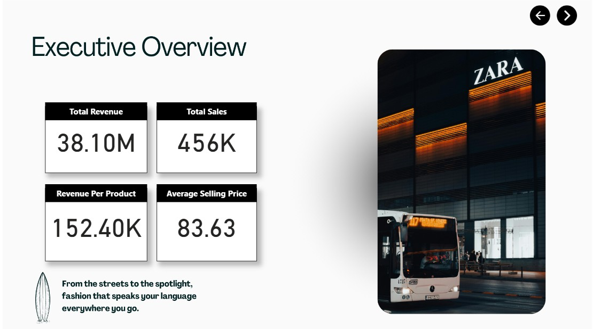
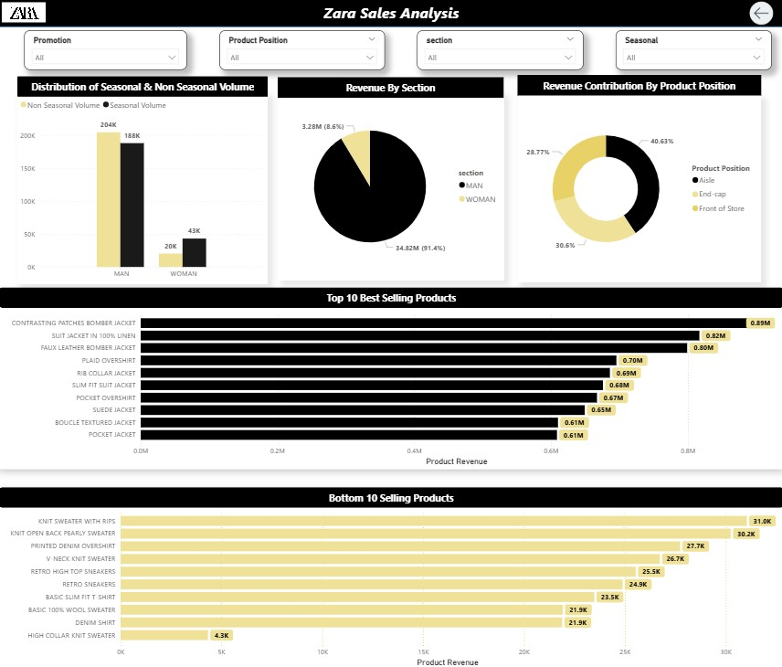
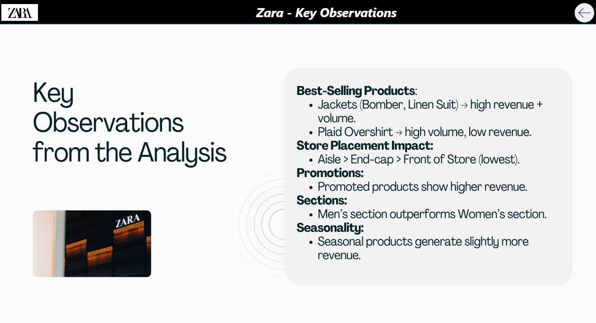
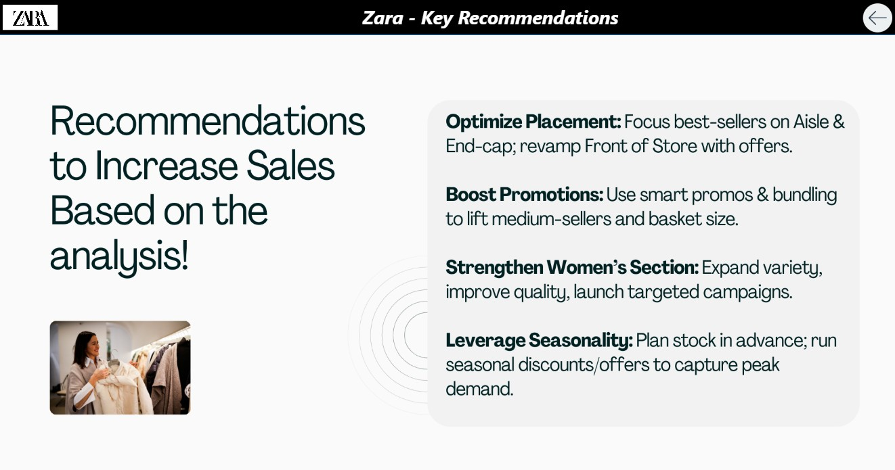

# Zara Sales Dashboard (Power BI)

This project is an **interactive Power BI dashboard** designed to analyze Zara’s sales performance and provide actionable business insights.  
It demonstrates skills in **data modeling, DAX calculations, and visualization storytelling**.

---

## 📥 Access the Dashboard

- [Download Zara Sales Dashboard (.pbix)](BI_dashboard/zara_sales_analysis.pbix)  
- Open in **Power BI Desktop** to explore interactively

---

## 🖼️ Preview

#### Home Page

#### Executive Page

#### Analysis

#### Key Observationa

#### Recommendations

## Tech Stack

- **Tool**: Power BI Desktop  
- **Data Preparation**: Power Query, DAX  
- **Modeling**: Star schema with fact and dimension tables  
- **Visualization**: Interactive charts, KPIs, slicers  

---

## About This Project

This dashboard was built to showcase **business intelligence and data visualization skills** by analyzing Zara’s sales dataset. It demonstrates the use of **Power BI for analytics storytelling**, helping decision-makers align business strategy with data-driven insights.

---
